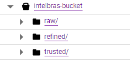
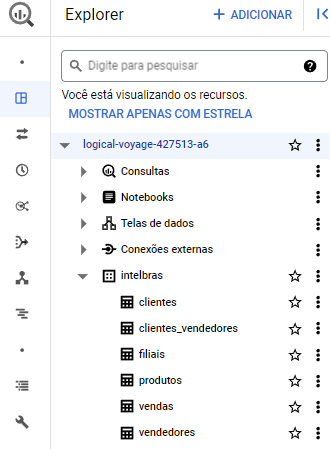
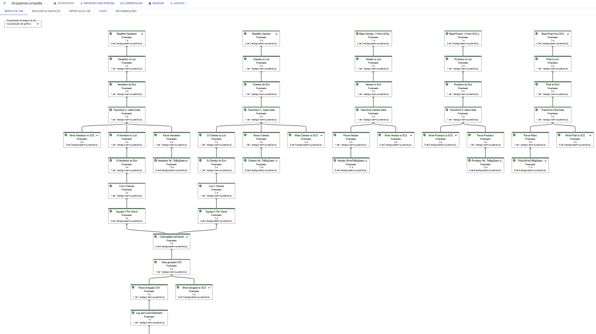
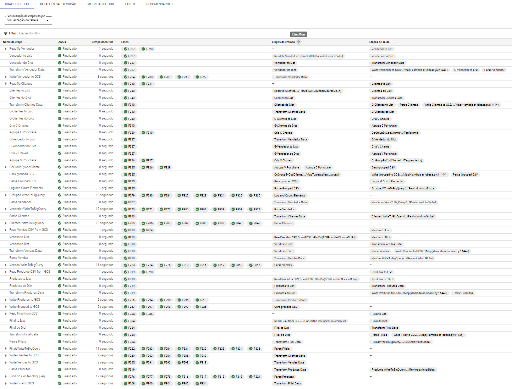
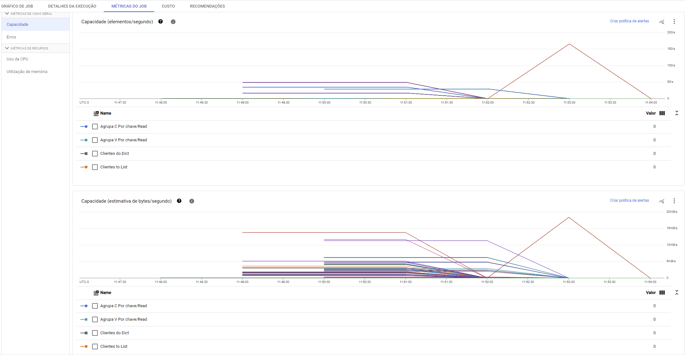

# Intelbras Case

Case de pipeline de dados no GCP para processo seletivo.

**Autor: Jorge Nascimento**

## Características

* Para execução deste projeto foi utilizada a linguagem python (versão 3.x) e criado um virtual enviroment específico para esta demanda.
* Todo o pipeline foi desenvolvido de forma programática ao invés de utilizar o designer do Google Dataflow facilitando a construção de pipelines customizados.
* No GCP foi criada uma conta de serviço com todos os privégios necessários e coletado o arquivo ***credencials.json*** para acessar a API de forma programática. Foi disponibilizada uma credencial de exemplo que precisa ser alterada e renomeada.
* Ae executar o pipeline, é gerado um arquivo de log e salvo na pasta `logs` registrando tudo o que foi executado durante o processo. Durante o desenvolvimento inúmeros erros foram encontrados e os logs foram essenciais para resolução de problemas.
* Ferramentas utilizadas do GCP: Cloud Storage, Dataflow e Big Query.

## Etapas para execução do projeto

1. Conferir se os arquivos necessários para a ingestão no bucket encontram-se na pasta `/files` do projeto.
2. Transformar planilhas de excel para CSV pois o dataflow não faz leitura nativa destes arquivos -> `excel_to_csv.py`
3. Criar bucket e carregar dados na camada RAW -> `create_bucket.py`
4. Criar o dataset no Google Big Query -> `create_bq_dataset.py`
5. Executar o pipeline para processamento -> `pipeline-dataflow.py`

Extra: dispobilizado o script `destroy_bucket.py` para apagar o bucket e todos os arquivos.

## Arquitetura

Pensando em arquitura de Datalake, foi adotado o padrão de camadas dentro do mesmo bucket. O ideal seria isolar as camadas em buckets distintos, mas geraria um custo extra para atender este case.

* **RAW** -> Dados brutos sem alterações.
* **REFINED** -> Dados limpos e tratados produzidos ao longo do pipeline.
* **TRUSTED** -> Joins e agregações oriundas de dados lidos da camada REFINED.

Dados gravados nas camadas **REFINED** e **TRUSTED** também foram carregados no Big Query para uma possível etapa de Analytics.

## Pipeline

Todo o processamento foi concentrado em 1 único Pipeline composto pelas seguintes etapas:

1. Leitura dos arquivos na camada **RAW**.
2. Limpeza e tratamento de todos os arquivos.
3. Persistencia dos dados tratados na camada **TRUSTED**.
4. Aplicação de schema e persistencia dos dados no **BigQuery**.
5. Join e agregações de 2 tabelas *(apenas para exemplificar)*.
6. Persistencia do resultado do *item 5* na camada **REFINED**.
7. Aplicação de schema do *item 5* e persistencia no BigQuery.

### Métricas de Execução

## Conclusões e observações

1. Por conta do curto prazo, o código não é uma versão final porém está 100% funcional, precisar ser melhorado em documentação, modularização e boas práticas.
2. Foi necessário criar nova conta para utilizar o GCP por 90 dias com 300 dolares de credito pois a utilização dos serviços envolvidos neste case geram custo.
3. O pipeline foi configurado para ser processado em apenas 1 worker de menor capacidade por conta dos custos.
